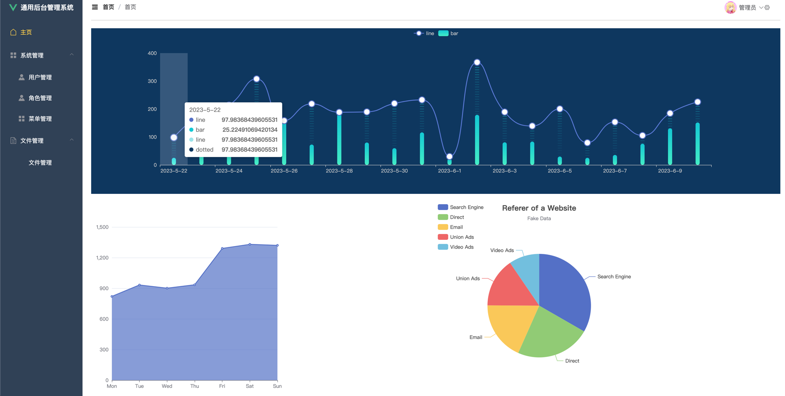
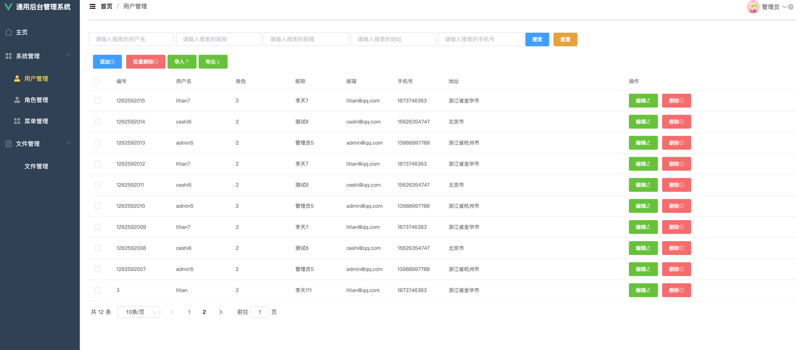
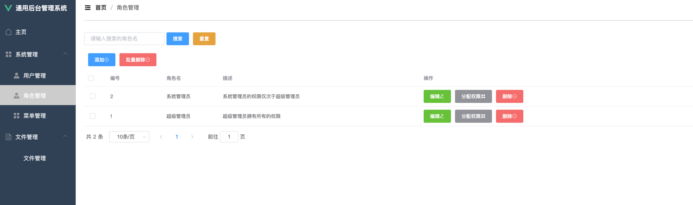
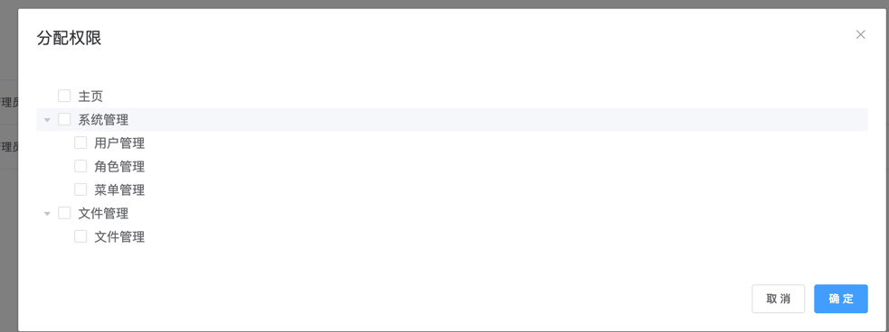
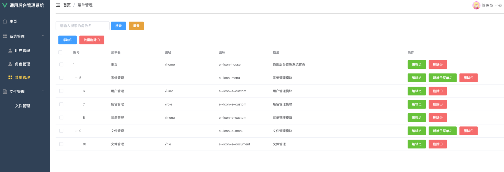
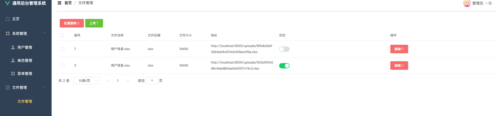

### gmsp
### general-manager-springboot
基于java+springboot+mybatis+vue+element-ui 通用管理后台

### 技术栈
* java: 8
* mysql: 5.7
* springboot: 2.7.6
* mybatis: 2.2.1
* mybatis-plus: 3.5.1
* 代码自动生成
* ExcelUtil
* jwt
* echarts

### 功能
1. 登陆
2. 首页面板
3. 系统管理
   * 用户管理
   * 角色管理
   * 菜单管理
    
4. 文件管理
    

### 效果

### vue
<a href="https://github.com/jeffcail/gmweb" target="_blank">vue部分</a>
